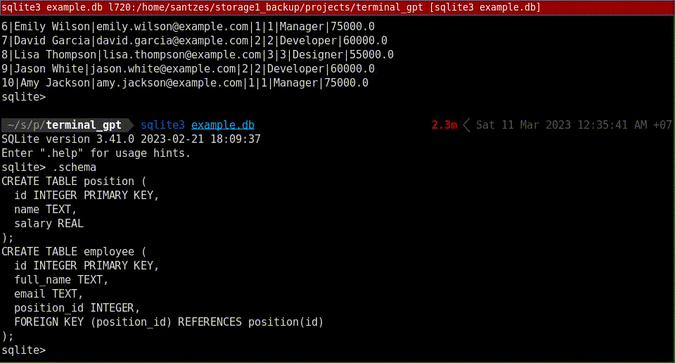

# ChatGPT Kitten for kitty terminal

Access ChatGPT from your kitty terminal with terminal text sent as data. Ask questions or use autocomplete.

## Features
### Chat


### Autocomplete


## Usage
- Autocomplete: This needs openai python library to be accessible to your kitty, so run pip install --user openai. Edit your OpenAI API key to gpt_kitten.py and copy it to to your kitty config dir (~/.config/kitty/). Add config line ```map kitty_mod+i kitten gpt_kitten.py``` to your kitty.conf (change the keys though.) You can add parameter -e to select what data will be sent from the screen - default is "selection,lastcmd,screen" which basically tries to get your selected text, and falls back to output of last or currently running command that isn't empty.
- Chat: either create venv with OpenAI python library or install it userwide like with autocomplete. edit OpenAI api key to kitty_assistant.py. Add line ```map kitty_mod+x launch --copy-env --hold  --stdin-source=@selection /usr/bin/python /path_to/kitty_assistant.py``` to your config (or use the venv python binary). You can choose what terminal data is used with --stdin-source - @selection, screen, @last_cmd_output, @screen_scrollback are good options, others can be found at [kitty docs](https://sw.kovidgoyal.net/kitty/launch/). You can also skip that argument if you want to just chat without terminal data. Press your chosen shortcut and start chatting.

## Drawbacks
- Code is absolutely horrible, I used a hammer and made this in like five different ways before coming to this solution, I can't be bothered to make it clean for a few days at least. Bugs are likely, pull requests are welcome.